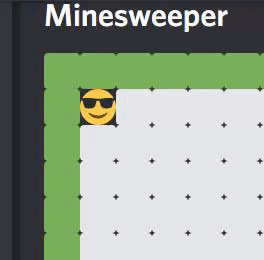
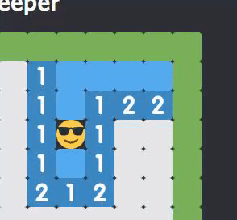
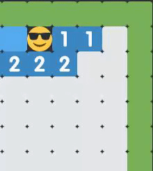
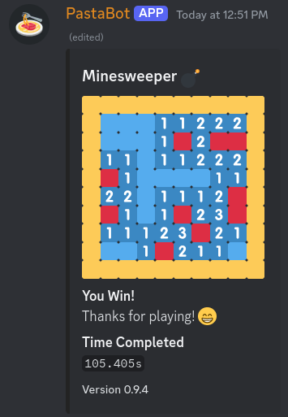
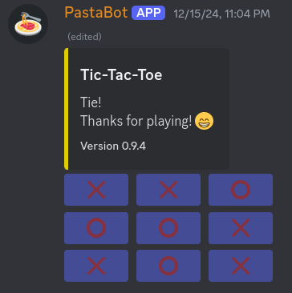

# Pasta Bot :spaghetti:

A [Discord](https://discord.com) Bot that I created with many different minigames and features to use within my own discord servers.

    

## :computer: Features

- Fully integrated with discord slash (/) commands
  - Provides autocomplete for certain command options too
- Customizable status display
  - Shows birthdays supplied by the `birthdays.json` file
  - Shows holidays/events supplied by the `events.json`
  - Integrates with a Minecraft server to display the current status of the server and current player count
- Reaction role messages that can be edited at any time
- Minecraft server integration to give the status of a Minecraft server
- Valorant integration to give custom roles for specific ranks
- And more!

## :rocket: Minigames

### Minesweeper

- Play a game of minesweeper right in discord
  - Use button controls for digging, moving, and flagging
- View player game statistics
  - Global leaderboard for fastest games, most played games and most won games

    
    
    
    

### Tic-Tac-Toe

- Ability to play against PastaBot themselves (with a scaling difficulty)
- Challenge other players to a match
- View player game statistics
  - Global leaderboard for most played and most won games

    

## :scroll: Changelog

> [!WARNING]
> The changelog is currently out of date and is receiving several updates as I go through and re-categorize each commit

[View changelog](CHANGELOG.md)

## :wrench: Building

> [!NOTE]
> This is mostly intended to be used for my own personal use. I will not be providing an in-depth setup guide

Setup can be accomplished with:

1. Cloning this repo
2. Running `npm install`
3. Filling out the `.env` file (an example can be found in `.env.example`)
4. Running the bot with `npm run start`
